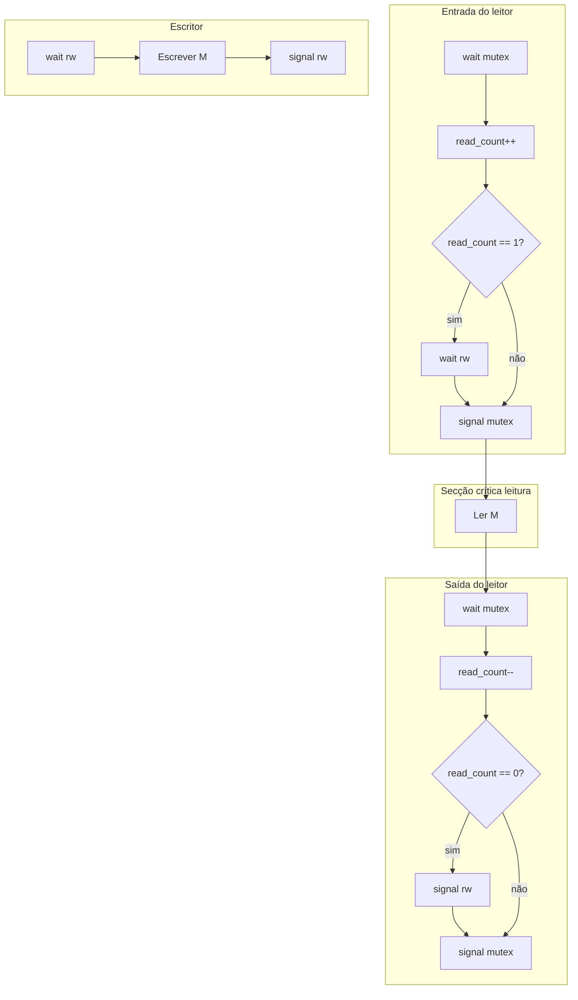
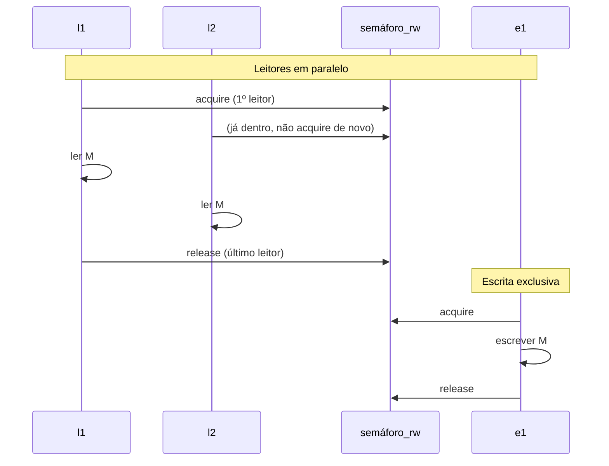

# Explicação detalhada de `readers_writers.py`

Este documento descreve o programa que implementa o **problema clássico dos Leitores e Escritores**: várias threads acedem ao mesmo vetor `M`, com regras diferentes para leitura e escrita.

## O problema que resolve

| Tipo | Regra |
|------|--------|
| **Leitores** (`l1`, `l2`, `l3`) | Podem ler **ao mesmo tempo** — uma leitura não altera os dados para outro leitor |
| **Escritores** (`e1`, `e2`) | Precisam de **acesso exclusivo** — ninguém mais (leitor ou escritor) pode aceder enquanto escrevem |

Sem sincronização, podem ocorrer **condições de disputa** (*race conditions*), por exemplo um leitor a ler `M` enquanto um escritor está a meio de alterar todos os elementos.

### Cenário da figura (enunciado)

| Ator | Operação |
|------|----------|
| `e1` | `M[3] = 2` |
| `e2` | `M = [2, 1, 0, 6]` |
| `l1` | ler `M[3]` |
| `l2` | ler `M` (vetor completo) |
| `l3` | ler `M[1]` |

Estado inicial: `M = [3, 7, 1, 9]`.

---

## Estado partilhado

```python
M = [3, 7, 1, 9]
read_count = 0
mutex = threading.Semaphore(1)
rw = threading.Semaphore(1)
_log_lock = threading.Lock()
```

| Variável | Função |
|----------|--------|
| **`M`** | Memória partilhada (vetor de inteiros) |
| **`read_count`** | Número de leitores dentro da secção crítica de leitura |
| **`mutex`** | Semáforo binário que protege apenas `read_count` |
| **`rw`** | Semáforo binário que separa escritores de leitores (portão principal) |
| **`_log_lock`** | Evita que duas threads misturem linhas no `print` (não faz parte do algoritmo clássico) |

Um semáforo com valor inicial `1` funciona como **mutex**:

- `acquire()` ≈ operação **wait** (decrementa; bloqueia se valor = 0)
- `release()` ≈ operação **signal** (incrementa; desbloqueia uma thread em espera)

---

## Algoritmo de sincronização

Variante **leitores com prioridade**, com **2 semáforos** (`mutex` e `rw`):



---

## Função `reader` — algoritmo do leitor

### Entrada

```python
mutex.acquire()
read_count += 1
if read_count == 1:
    rw.acquire()
mutex.release()
```

1. **`mutex.acquire()`** — entra na zona protegida do contador.
2. **`read_count += 1`** — regista mais um leitor ativo.
3. **Se `read_count == 1`** — primeiro leitor:
   - **`rw.acquire()`** — bloqueia escritores enquanto existirem leitores.
4. **Se `read_count > 1`** — já há leitores; **não** chama `rw.acquire()` outra vez (evita deadlock).
5. **`mutex.release()`** — liberta o contador para outros leitores entrarem em paralelo.

### Secção crítica

- **`l1`** (`op == "index_3"`) → lê `M[3]`
- **`l2`** (`op == "full"`) → cópia `list(M)` (snapshot consistente)
- **`l3`** (`op == "index_1"`) → lê `M[1]`

O `time.sleep(0.08)` serve apenas para tornar visível no output que vários leitores podem estar “dentro” ao mesmo tempo.

### Saída

```python
mutex.acquire()
read_count -= 1
if read_count == 0:
    rw.release()
mutex.release()
```

1. Protege `read_count`.
2. Decrementa leitores ativos.
3. **Se `read_count == 0`** — último leitor → **`rw.release()`** — escritores podem entrar.
4. Liberta `mutex`.

---

## Função `writer` — algoritmo do escritor

```python
rw.acquire()
# ... escrever em M ...
rw.release()
```

1. **`rw.acquire()`** — espera até não haver leitores nem outro escritor.
2. Escreve:
   - **`e1`** → `M[3] = 2`
   - **`e2`** → `M = [2, 1, 0, 6]`
3. **`rw.release()`** — liberta o acesso.

O escritor **não usa** `read_count` nem `mutex` — só precisa de exclusão total via `rw`.

---

## Sequência típica de execução



Exemplo de output:

1. `e1` escreve `M[3]=2` → `M = [3, 7, 1, 2]`
2. `e2` reescreve tudo → `M = [2, 1, 0, 6]`
3. `l1`, `l2`, `l3` entram ao mesmo tempo e leem o estado atualizado
4. Estado final: `[2, 1, 0, 6]`

A ordem entre execuções **não é fixa**; o que importa é respeitar exclusão na escrita e paralelismo na leitura.

---

## Função `main`

```python
threads = [
    threading.Thread(target=writer, args=("e1", "set_index_3"), name="e1"),
    threading.Thread(target=writer, args=("e2", "set_all"), name="e2"),
    threading.Thread(target=reader, args=("l1", "index_3"), name="l1"),
    threading.Thread(target=reader, args=("l2", "full"), name="l2"),
    threading.Thread(target=reader, args=("l3", "index_1"), name="l3"),
]
for t in threads:
    t.start()
for t in threads:
    t.join()
```

- **`start()`** — arranca as 5 threads; o escalonamento é do SO / interpretador.
- **`join()`** — o programa principal espera todas terminarem antes do estado final.

---

## Porque não há deadlock

- Esperas apenas em **`mutex`** e **`rw`**, com ordem fixa no leitor:
  - adquire `mutex` → (talvez) `rw` → liberta `mutex` → trabalha → `mutex` → (talvez liberta `rw`)
- O escritor só usa `rw`.
- O leitor **nunca** espera por `mutex` enquanto segura `rw` (liberta `mutex` antes de ler `M`).

---

## Limitação conhecida

Esta variante dá **prioridade aos leitores**: se leitores chegarem continuamente, um escritor pode esperar muito (*starvation*). O enunciado pede evitar **deadlock**, não garantir justiça entre leitores e escritores.

---

## Como executar

```bash
python3 readers_writers.py
```

---

## Resumo

**`mutex` + `read_count`** controlam quantos leitores estão ativos; **`rw`** garante que, enquanto existir pelo menos um leitor, nenhum escritor entra, e que cada escritor tem `M` só para si — reproduzindo o cenário do enunciado com threads e semáforos em Python.
